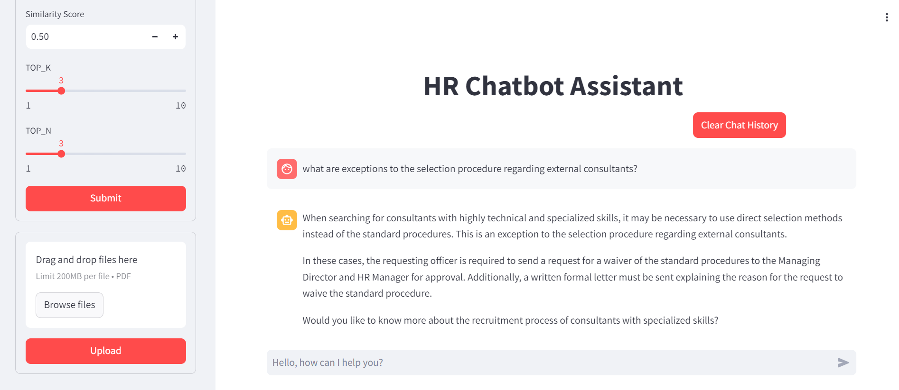
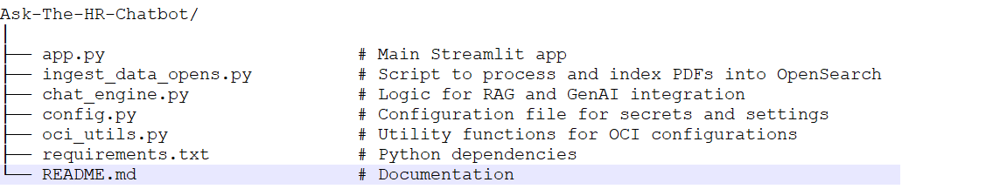

# HR Chatbot Assistant using OCI opensearch

## Overview
This project is an HR Help Desk chatbot solution built using Generative AI (GenAI) combined with Retrieval-Augmented Generation (RAG) on Oracle Cloud Infrastructure (OCI). The solution is designed to improve response times, enhance accuracy, reduce HR workload, and increase employee satisfaction by leveraging natural language processing (NLP) and machine learning to respond to employee queries. The application also integrates with OpenSearch to store and retrieve information from uploaded PDF documents.

[](https://github.com/psf/black)



This repository contains all the work done on the development of RAG applications using:

* [OCI OpenSearch](https://docs.oracle.com/en-us/iaas/Content/search-opensearch/home.htm)
* Oracle OCI [GenAI Service](https://docs.public.oneportal.content.oci.oraclecloud.com/en-us/iaas/Content/generative-ai/home.htm)
* Oracle OCI[ Embeddings](https://docs.public.oneportal.content.oci.oraclecloud.com/en-us/iaas/Content/generative-ai/embed-models.htm)
* Oracle Accelerated Data Science [ADS](https://accelerated-data-science.readthedocs.io/en/latest/)
* [llama-index](https://docs.llamaindex.ai/en/stable/)


## What is RAG?

A very good introduction to what **Retrieval Augmented Generation** (RAG) is can be found [here](https://www.oracle.com/artificial-intelligence/generative-ai/retrieval-augmented-generation-rag/)


## Project Structure



## Setup

* configure conda environment based on requirement.txt
* configure .oci directory with .key& config for [OCI authentication](https://docs.oracle.com/en-us/iaas/Content/API/Concepts/sdkconfig.htm).
* [create opensearch cluster](https://docs.oracle.com/en-us/iaas/Content/search-opensearch/Tasks/creatingsearchclusters.htm)
* update parameter in config.py

## Installation

1. Clone the Repository:
   ```
   git clone git@github.com:pavan-upadhyay/opensearch-chatbot.git
   cd Ask-The-HR-Chatbot
   source ./venv/bin/activate
   ```
2. Install Dependencies:
   ```
   pip install -r requirements.txt
   ```
   
3. Set Up Configuration:
   Update the config.py file with your OCI and OpenSearch configurations, including endpoint URLs, usernames, and passwords.


4. Run the Application:
   ```
   streamlit run app.py
   ```

## Usage

1. **Upload PDFs:** Use the file uploader in the Streamlit sidebar to upload PDF documents. These documents will be processed and indexed into OpenSearch page by page.
2. **Interacting with the Chatbot:** Type your query in the chat input box at the bottom of the web page. The chatbot will process your query and return a response based on the indexed documents.
3. **Adjusting Parameters:** Use the sidebar to adjust model parameters like max_tokens, temperature, top_k, top_n, and similarity. Click "Submit" to apply the changes.
4. **Clear Chat History:** Click the "Clear Chat History" button to reset the conversation.

## Troubleshooting
### Common Issues
- **Index Not Created:** Ensure your OpenSearch cluster is correctly configured in config.py and accessible from your environment.
- **Errors in PDF Processing:** Check if the PDFs are in a supported format and correctly uploaded.
- **Parameter Errors:** Make sure the values entered for max_tokens, temperature, etc., are within the specified ranges.

### Logs
   Logs are available in the console output where the Streamlit app is running. They provide detailed information about the operations, including errors and successes.